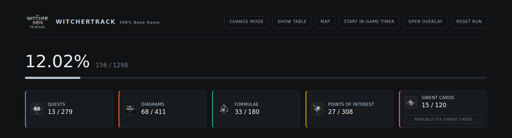
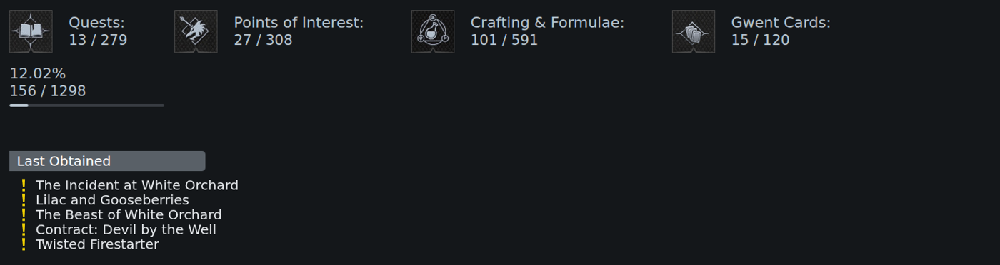
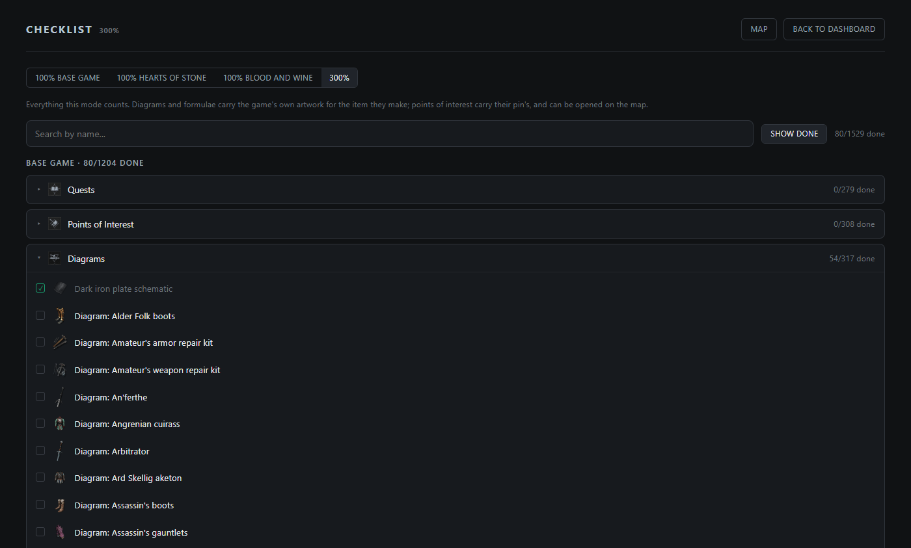
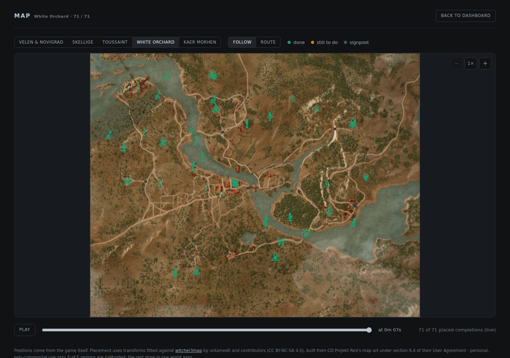

<h1 align="center">WitcherTrack</h1>

<p align="center">
  A completion tracker for <b>The Witcher 3: Wild Hunt</b>, built for 100% and 300% runs.
</p>

<p align="center">
  <a href="../../releases/latest"></a>
  <a href="../../actions/workflows/release.yml"></a>
  
  
  <a href="LICENSE"></a>
</p>

It reads the game's own data, evolved from an OCR tool from the past, so every quest, diagram, formula, point of
interest and Gwent card is identified by the internal name the game uses.



**[Download the latest release →](../../releases/latest)**, it's one `.exe` and the mod, no runtime to
install, no configuration to edit before the first run.

```
WitcherTrack.exe
  http://127.0.0.1:7355/          dashboard
  http://127.0.0.1:7355/overlay   OBS browser source
  http://127.0.0.1:7355/map       interactive map and run playback
```

---

## Contents

- [What it does](#what-it-does)
- [Requirements](#requirements)
- [Installation](#installation)
  - [1. The in-game reporter](#1-the-in-game-reporter)
  - [2. Turn on the script log](#2-turn-on-the-script-log)
  - [3. The tracker](#3-the-tracker)
  - [4. Check that it works](#4-check-that-it-works)
- [Troubleshooting](#troubleshooting)
- [Uninstalling](#uninstalling)
- [Using it](#using-it)
- [Commands](#commands)
- [How it works](#how-it-works)
- [Building from source](#building-from-source)
- [Reporting a problem](#reporting-a-problem)
- [Acknowledgements](#acknowledgements)
- [License](#license)

---

## What it does

**Live counting across five modes.** A mode is a *view over the same run*, not a separate
run: base game, Hearts of Stone, Blood and Wine, 300% with everything combined, and the
Gwent collection on its own. Finishing base-game content during a Blood and Wine run is
never lost as it does not count in that view and does count in the 300% view.

| Mode | Counts |
|---|---|
| `base100` | White Orchard, Velen, Novigrad, Skellige, Kaer Morhen with no DLC |
| `hos100` | Hearts of Stone only with standalone start, no main game |
| `baw100` | Blood and Wine only with standalone start, no main game |
| `all300` | all three, combined |
| `gwent100` | every base-game Gwent card except Roach, and nothing else |

> **Gwent has two right totals and they are not the same.** A complete base-game collection
> is 127 card types: the five faction lists come to 120, and the other seven are the special
> cards the game files apart from every faction, Decoy, Commander's Horn, Scorch and the four
> weather cards. 120 is the number quoted everywhere, because a card list prints the specials
> and the leaders in tables of their own, so that is what 100% and 300% count. A Gwent run is
> collecting the deck, so it counts all 127. The twenty leader cards are in neither: the game
> keeps them in a list the reporter has no way to read.

> **Diagrams and formulae are filed by a list kept by hand.** The game reports a content
> pack for quests and nothing at all for schematics, so they are listed by identifier and
> everything else counts as base game. Blood and Wine has ninety-six - sixty-five diagrams,
> plus the armour dyes and the mutagen transmutators - and Hearts of Stone has thirty.

The game can be started directly into either with a pre-made Geralt who already knows a number 
of diagrams and formulae; because the tracker reads real game state rather than assuming a 
starting loadout, those simply arrive as already completed. 
There is no hardcoded starting-item list to keep in sync.

**A stream overlay.** A single browser source, sized to sit across the top or bottom of a
stream, with the four category counts, a progress bar and the last few completions.



**A checklist**, on its own page. Every quest, point of interest, diagram, formula and card
the mode counts, done and not, scored `X/Y done` at every level and searchable by name. A
300% run splits it by content pack as well. Finished rows stay in place with their box
ticked - a box that can never be seen ticked is decoration - and can be put away when they
get in the way.



Every diagram and formula carries **the game's own inventory artwork for the item it
makes**: 474 icons, extracted from a local game install by `tools/extract_icons.py` and
carried inside the executable. A schematic's own icon is the same scroll for every one of
them, which is why they all look alike in the game's inventory; the icon worth showing
belongs to what the schematic *produces*, and the game's own data says which that is.

Points of interest carry their pin's artwork and a *see on map* that opens the map turned
to that exact point. That is the only way to tell one Bandit Camp from the fifty-one
others: the game gives its map pins a type and a place, never a name.

**An interactive map with run playback.** Every point of interest is placed from the
coordinates the game reports, through a transform fitted per region and verified against
real map art. Quests, diagrams, formulae and Gwent cards are placed too, from where the
player was standing when each was finished. Scrub the timeline to replay the run, follow
the completions as they light up, and switch on the route trail to see the run pathing.



**In-game time.** Optional, Windows only. The tracker can attach to the game's own clock
and read elapsed in-game time, so the progress chart is plotted against play time rather
than wall-clock time. It is off until you press the button, and it only ever reads.
This is based on [Gaztin](https://github.com/gaztin)'s work. It's still a bit WIP.

**A run that survives being closed.** The tracker keeps its own record of the run beside
the executable, so shutting it down, restarting the game, or coming back the day after resumes
where you were with every completion still carrying the time it actually happened. 

**A completions table**, in order, with time played and content pack for each entry.


### Why not read the screen

The previous version of this tracker matched the game's on-screen popups with OCR. That
worked until it didn't. Measured over a real run's frame database: the matcher accepted a 
fuzzy match at 0.70 similarity while **20.7% of crafting diagrams have a near-twin at 0.90 or above**.

```
0.958  'diagram svarog runestone'   <->  'diagram tvarog runestone'
0.938  'diagram greater glyph of binding'  <->  '... of mending'
0.983  'scavenger hunt griffin school gear upgrade diagrams part 3'  <->  '... part 4'
```

The OCR also could not see points of interest or Gwent cards at all, and it couldn't undo
anything.

---

## Requirements

- **The Witcher 3: Wild Hunt** on Windows — any store (Steam, GOG, Epic), next-gen or
  classic.
- **Windows 10 or 11** to run the tracker. Nothing else: the release is a single
  self-contained `.exe` with no .NET runtime to install.
- Administrator rights once, to create a folder inside the game directory.

---

## Installation

Two pieces: the **in-game reporter** (a small mod, which is what actually sees anything)
and the **tracker** (an app on your desktop that reads what the reporter writes). Both are
needed: without the mod the tracker starts and sits at 0% forever.

Only one thing has to happen in order, and it is steps 1 and 2: **the mod and the
`-debugscripts` flag have to be in place before the game launches**, because the game
compiles its scripts at startup. The tracker is free either way. It can be started before
the game, after it, or in the middle of a session, and it reads the log from the beginning.

### 1. The in-game reporter

#### 1.1 Find the game folder

Whichever store you bought it from, you are looking for the folder that contains `bin`,
`content` and `DLC`. The defaults are:

| Store | Path |
|---|---|
| **Steam** | `C:\Program Files (x86)\Steam\steamapps\common\The Witcher 3\` |
| **GOG** | `C:\Program Files (x86)\GOG Galaxy\Games\The Witcher 3 Wild Hunt GOTY\` |
| **Epic** | `C:\Program Files\Epic Games\The Witcher 3\` |

If you moved the install, find it from the launcher: Steam → right-click the game →
*Manage* → *Browse local files*. GOG Galaxy → the game → *More* → *Manage installation* →
*Show folder*.

#### 1.2 Copy the mod

Extract `modWitcherTrack.zip` into a `Mods` folder in that game directory, creating `Mods`
if it does not exist. Windows will likely ask for administrator rights, as the game lives
under `Program Files`. 

The result must look **exactly** like this with four files, and the folder names matter:

```
<game>\Mods\modWitcherTrack\content\scripts\
    local\witchertrack.ws
    game\player\playerWitcher.ws
    game\gui\hud\modules\hudModuleJournalUpdate.ws
    game\gameplay\effects\effectManager.ws
```

`local\witchertrack.ws` is the reporter itself: it declares new functions and nothing
else. The three files under `game\` are the game's own scripts with **seven one-line calls**
added, each of which only appends a line to the log. Nothing vanilla is changed, skipped
or given a different value. Every hook is listed and explained in
[`mod/HOOKS.md`](mod/HOOKS.md).

> **If you use other script mods, run [Script
> Merger](https://www.nexusmods.com/witcher3/mods/484) afterwards.** Those three vanilla
> files are commonly edited by other mods, and the merger resolves the overlap. Without
> it, whichever mod loads last wins and the other silently stops working.

> **After a game update, re-patch.** The three vanilla files are copies of *that version*
> of the game's scripts. A patch that changes them will make the mod undo the patch for
> those files. Regenerate them from your updated install:
>
> ```powershell
> python mod\patch_mod.py --scripts "<game>\content\content0\scripts"
> ```
>
> and re-zip the result. The release ships copies from the version it was built against.

#### 1.3 What the mod does not do

It never writes to disk, never modifies a savegame, never alters game state, and makes no
network connection. It appends lines to the log the game already writes. Deleting the
folder removes it completely.

### 2. Turn on the script log

The game only writes its script log when it is started with `-debugscripts`. This is a
stock developer flag; it does not disable achievements and does not change anything else.

**Steam** — right-click the game → *Properties* → *General* → *Launch Options*:

```
-debugscripts
```

**GOG Galaxy** — the game → the settings cog next to *Play* → *Manage installation* →
*Configure* → add `-debugscripts` to the executable arguments.

**Epic, or any store, using a shortcut** — right-click `bin\x64\witcher3.exe` (or
`bin\x64_dx12\witcher3.exe` for the DirectX 12 build) → *Send to* → *Desktop (create
shortcut)*, then right-click the shortcut → *Properties*, and append the flag to *Target*,
outside the quotes:

```
"C:\...\bin\x64\witcher3.exe" -debugscripts
```

Launch from that shortcut from then on.

### 3. The tracker

Download `WitcherTrack.exe` from the latest release and put it anywhere you like. There is
nothing to extract. It does not need to live near the game, and it never writes inside the
game folder.

`WitcherTrack.exe` is the whole tracker. The catalogue of everything trackable, the map
artwork and the web interface all travel inside it, so a single downloaded file is enough.

```
WitcherTrack\
  WitcherTrack.exe
  run.json                     written by the tracker: the run in progress
```

A `data` folder beside the executable is read in preference to what is inside it, which is
how a catalogue rebuilt after a game update takes effect:

```
WitcherTrack\
  WitcherTrack.exe
  data\
    catalog.json               overrides the built-in catalogue
    map\
      calibration.json         overrides the built-in map transforms
      backgrounds.json
      *.webp                   overrides the built-in region artwork
```

Run `WitcherTrack.exe`. It prints what it loaded, and says whether each piece came from a
file or from the executable, then opens the dashboard at
<http://127.0.0.1:7355/>. It listens on the loopback address only: nothing is exposed to
your network, and it makes no outbound connections.

> Windows SmartScreen may warn about an unsigned executable the first time. *More info* →
> *Run anyway*. If you would rather not trust a binary, you can [build it
> yourself](#building-from-source), it takes one command.

### 4. Check that it works

Start the game with the flag, load any savegame, then open:

```
Documents\The Witcher 3\scriptslog.txt
```

It should contain lines like these:

```
WT|v1|meta|hook|player_spawned
WT|v1|meta|begin|light
WT|v1|quest|Q001 Dream C1AA4441-48FF64E8-972B3BB9-250CC191|done
WT|v1|diagram|Light Armor 1 schematic|done
WT|v1|poi|camp1_creatures|done
WT|v1|meta|end|light
```

Loading a savegame is enough to produce them: the reporter asks the game for a full report
every time the player entity is created.

If those lines are there, the reporter works and the rest is just the tracker reading them.
Start `WitcherTrack.exe` whenever you like: it reads the log from the beginning, so a
session already in progress is picked up in full rather than from the moment you started
it.

---

## Troubleshooting

**`scriptslog.txt` does not exist, or has no `WT|` lines in it.**
The game is running pre-compiled scripts with logging stripped out. Delete the
`.redscripts` files in `<game>\content\content0\` and start the game again; it regenerates
them from source, with logging on. The first launch after this takes noticeably longer.
Check the `-debugscripts` flag actually applied, too. If you launch from a desktop icon
the store created, Steam's launch options still apply, but a raw shortcut to
`witcher3.exe` does not carry them.

**The game shows a script compilation error on startup.**
Remove `Mods\modWitcherTrack` and it will start normally again. The error text names the
file and the line, that is the useful part of a bug report. The usual cause is a game
update that changed the vanilla scripts; see the re-patch note above. If it persists, open
an issue on GitHub or send me a DM on Discord.

**Another script mod stopped working after installing this.**
Run Script Merger. Two mods cannot each ship their own copy of the same vanilla file.

**The dashboard opens but stays at 0%, and nothing ever arrives.**
The tracker is running and hearing nothing, which means the reporter is not writing. Check
`Documents\The Witcher 3\scriptslog.txt` for lines beginning `WT|`. None at all means the
mod is not installed, is in the wrong folder, was overwritten by another script mod (run
Script Merger), or the game was launched without `-debugscripts`. The tracker cannot tell
the difference between "nothing has happened yet" and "no mod": the log looks the same.

**The dashboard says `No catalog.json found`.**
The executable carries its own catalogue, so this means the file it was built with was
missing. Download the release again, or build with `data\catalog.json` in place.

**The numbers went down.**
That is a feature. You loaded an earlier save and the tracker followed you back.

---

## Uninstalling

Delete `Mods\modWitcherTrack`, remove `-debugscripts`, delete the tracker folder - which
takes `run.json`, the only file the tracker writes, with it. Nothing else is touched — no registry keys, no files inside the game, no changes to any savegame.

---

## Using it

**Dashboard** — <http://127.0.0.1:7355/>. Pick a mode on first run; it holds for as
long as the tracker is running, and the overlay follows it.
*Show table* lists every completion in order, *Map* opens the map view, *Reset run* starts
a fresh run and forgets the stored one, *Start in-game timer* attaches the optional clock.

The in-game timer is a pause button, not a stopwatch that can only be thrown away: stopping
it keeps the total, restarting continues from there, and the total is saved with the run, so
a run spread over several evenings adds up. Only *Reset run* puts it back to zero. While it
is attached, the button reads the game's loading flag once a second and shows `· loading`
whenever the game is on a loading screen, which is also the quickest way to confirm it
attached to the right build.

Every start, pause and reset is recorded with the real time it happened at: printed to the
console as it happens and kept with the run, where `/api/timeline` and `run.json` both show
it. Speedrun rules require a single unbroken session, so a timer that can be paused is only
worth anything if the pause is on the record.

The run is saved to `run.json` beside the executable a couple of seconds after anything
changes, and resumed automatically next time. Back it up by copying that one file; move a
run to another machine the same way.

**OBS** — add a **Browser** source pointing at <http://127.0.0.1:7355/overlay>, and turn
off *Shutdown source when not visible*. The overlay is transparent, so it composites
straight over gameplay. It updates over server-sent events: no polling, no refresh.

**Map** — <http://127.0.0.1:7355/map>. Pick a region, zoom, drag to pan, and drag the
slider to replay the run. *Follow* keeps the view centred on whatever is lighting up next;
*Route* draws a trail through the completions in the order they happened. Signposts are
drawn as small neutral dots.

---

## Commands

```
WitcherTrack                 serve the dashboard and overlay (default)
WitcherTrack parse <file>    inspect one savegame and report what was read
WitcherTrack catalog <log>   build the catalogue from a reference dump
WitcherTrack replay <log>    replay a script log and print where the run stands
WitcherTrack export [file]   write the catalogue out as a table
WitcherTrack diff <list.csv> name what is missing versus a list you keep
WitcherTrack selftest        verify the completion rules
WitcherTrack credits         print the licence and the third-party terms
```

`selftest` runs the counting rules against known cases and prints a pass/fail report. It
ships inside the binary on purpose: anyone who downloads a release can confirm the rules
behave as documented without installing a test runner or building from source.

The reporter also exposes `wt_dump`, `wt_pins`, `wt_gwent` and `wt_sweep` for forcing a
report on demand. These are `exec` functions, so they need either a debug-console enabler
mod, or `rw3d_cli` with the game launched using `-net`:

```
rw3d_cli.exe exec "wt_dump()"
```

Neither is required for normal use as every report the tracker needs happens on its own.

---

## How it works

```
  in-game reporter ──> scriptslog.txt ──┐
                                        ├──> append-only event log ──> progress by mode ──> HTTP + SSE
  savegame files ───────────────────────┘                                        │
                                                                          dashboard
  manual corrections ─────────────────────────────────────────────────>    overlay + map
```

Everything observed is appended to a log and never rewritten. What you see is derived from
that log, with a fixed order of precedence:

1. a manual correction, which always wins;
2. a chest proven done by the treasure hunt that opened it;
3. the most recent full snapshot;
4. events recorded after that snapshot;
5. otherwise, not done.

Rule 3 is what makes reloading safe. A snapshot describes the world as a whole, so it
supersedes everything before it. 

**Notifications are never the last word.** Every hook in the reporter only *prompts a
re-read* of authoritative state, none of them is trusted to describe it. The game has no
notification at all for a map pin, so those are read back by sweeping the map manager. 

**Two independent sources, on purpose.** The reporter is live and drives the overlay while
you play. The savegame reader is a reconciliation pass: it reads what the game actually
wrote to disk, needs no mod and no launch flags, and keeps working if a game update breaks
the reporter. Neither is a fallback for the other, it's just that one is fast, the other is
authoritative.

---

## Building from source

```powershell
dotnet build
dotnet run --project src/WitcherTrack.App -- selftest
dotnet run --project src/WitcherTrack.App
```

Needs the **.NET 10 SDK** and nothing else. The release build is Native AOT, which cannot
cross-compile, so it is produced on a Windows runner:

```powershell
dotnet publish src/WitcherTrack.App -c Release -r win-x64 -p:PublishAot=true -o publish
```

### Project layout

```
src/WitcherTrack.SaveFormat/   savegame container: LZ4 blocks, SAV3 index
src/WitcherTrack.Core/         catalogue, event log, completion modes, progress rules
src/WitcherTrack.App/          the executable: HTTP server, dashboard, overlay, map
mod/                           the in-game reporter, its hooks, and the patcher
tools/                         map calibration fitting and background building
data/                          catalogue and map artwork shipped with the release
```

## Reporting a problem

The single most useful thing to attach to a GitHub issue is the script log,
`Documents\The Witcher 3\scriptslog.txt`, or the part of it around what went wrong. 

Worth saying in the report:

- what the tracker showed, and what the game showed;
- whether it was wrong immediately or only after a reload;
- the game version and store, if a script compilation error is involved.

If the game refuses to start after installing the reporter, remove `Mods\modWitcherTrack`
and paste the error text — it names the file and the line, which is the whole answer.

## Acknowledgements

The savegame format was established with reference to
[W3SavegameEditor](https://github.com/Atvaark/W3SavegameEditor) by Atvaark, and
verified against real savegames. [Witcher3MapViewer](https://github.com/reubengann/Witcher3MapViewer)
by reubengann showed that a savegame-driven companion app is practical.

Map placement was fitted against [witcher3map](https://github.com/untamed0/witcher3map) by
untamed0 and contributors (CC BY-NC-SA 4.0).

The ingame timer was based on [Gaztin](https://github.com/gaztin)'s Load Remover used by years
in The Witcher 3's speedrunning community.

## License

[CC BY-NC-SA 4.0](LICENSE): use it, change it, pass it on, credit the source, and do not
sell it.

The Witcher 3, its logo, its icons and its map are the property of CD PROJEKT RED and are 
used here without permission, under section 9.4 of their User Agreement:

> If you create your User Generated Content using any of CD PROJEKT RED graphics, audio,
> video, text or any other content - you may use it and share for personal enjoyment, but
> we do not allow any use of it for financial profit.

The region artwork travels inside the executable, so the executable states the terms
itself: `WitcherTrack credits` prints the licence in full, with no file needed beside it.
The map view carries its own credit line at the place the artwork is looked at.

This project is not affiliated with or endorsed by CD PROJEKT RED.